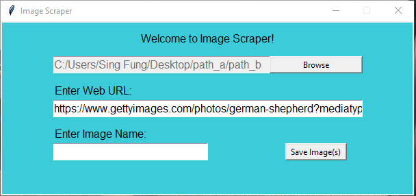

# README
Note from June 4, 2020 
This is a program that uses <a href = "https://www.python.org/" target = "_blank">Python</a> and <a href = "https://en.wikipedia.org/wiki/Web_scraping" target = "_blank">webscraping</a> for automating the task of saving photos.
Because right-clicking and saving each individual images from a website can be very tedious and time consuming, I hope this program will help with saving some time.

Here is how it works: 
First, we have the program, which looks like this.

  

To begin, we select where we want our images to be saved by clicking on the <strong>browse</strong> button, and the following window should pop up.

  

After selecting the destination, copy and paste a URL into the <strong>Enter Web URL</strong> box.

  

<h2>Note</h2>
It should be noted that this program only works well with static websites (all the images already loaded). With sites that use <a href = "https://www.javascript.com/" target = "_blank">Javascript</a> and "<a href = "https://en.wikipedia.org/wiki/Lazy_loading" target = "_blank">lazy loading<a>", this program will not work well.

  

Next, type in the name for the images you want to be saved in the <strong>Enter Image Name</strong> box. The program will automatically append numbers lexicographically to the image name for each photo detected on the website (we will see what that means in the next example.

Finally, the program will perform its magic and we can see from the image below that all the images are saved and numbered lexicographically (00,01,02,03, ...). 

  

Happy webscraping!

<h2>IMPORTANT</h2>
<h3>By using this program, you agree that you will not use this software for commercial purposes and that you should always respect the owners of the photos you save. I am not responsible for any file alteration, deletion, modification, or any other mishaps you may come across from using this program.</h3>
